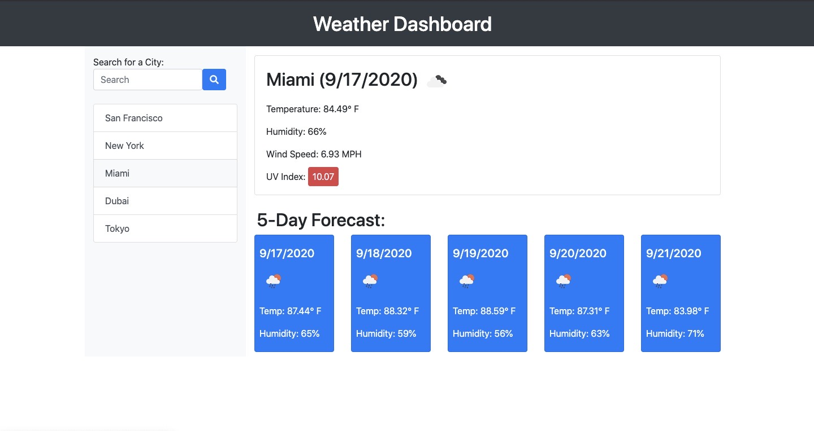
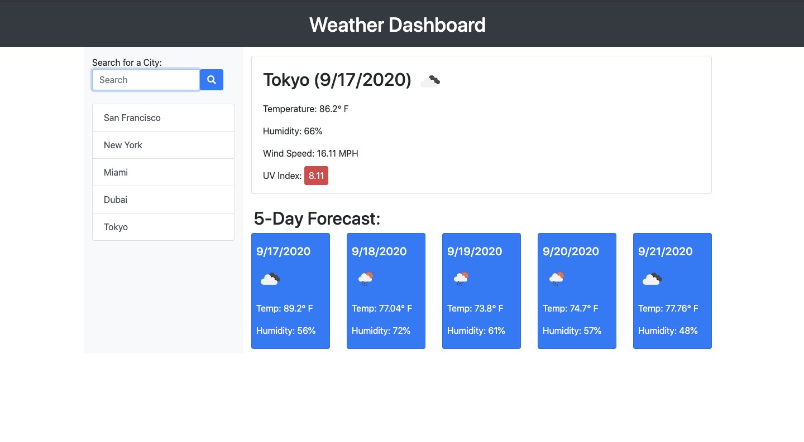

# Weather-Dashboard

This is a program designed to work as a weather dashboard. It allows a user to search, view, and store the current and future weather conditions for any city around the world. The program uses city weather data from the OpenWeather API and runs in a browser.

Weather Dashboard Program: https://dit1091.github.io/Weather-Dashboard/ 

Screenshots:

